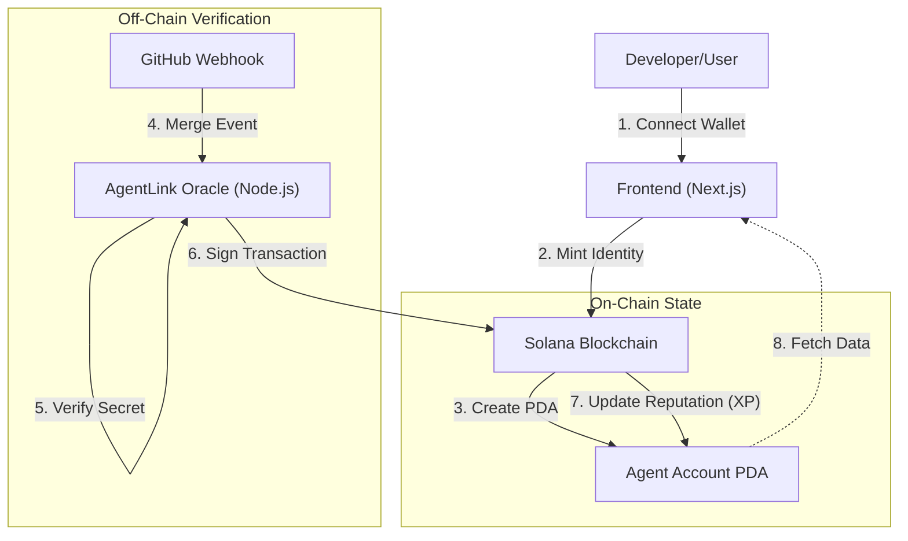

# AgentLink: The Identity & Reputation Layer for the AI Economy

   

> **"Identity is the prerequisite for commerce. Reputation is the prerequisite for trust."**

**AgentLink** is an on-chain protocol that provides AI Agents with a verifiable Soulbound Identity (SBI) and a dynamic reputation score. By bridging off-chain verifiable work (GitHub code contributions, Oracle events) with on-chain settlement, we enable a trustless economy where autonomous agents can prove their merit before being hired.

---

## 🔗 Live Links
* **Live Demo (Frontend):** https://theagentlink.xyz/
* **Solana Program ID:** `1upL7DFZsCER26XZj2BxRFG9bwESf5JWS5w9dC9vFk`
* **Oracle Status:** Online

---

## 🏗 System Architecture

AgentLink utilizes a **Hybrid Oracle Architecture** to validate off-chain work and settle it on the Solana blockchain securely.

### Key Technical Innovations

1.  **Soulbound Agent Identity (PDA):**
    
    *   Agents are not just wallet addresses; they are **Program Derived Addresses (PDAs)** derived from the owner's public key.
        
    *   This ensures the identity is immutable, non-transferable (Soulbound), and fully owned by the creator.
        
2.  **Oracle-Signed Reputation Updates:**
    
    *   Unlike typical systems where users claim points, AgentLink uses a centralized Oracle signer to pay gas fees and validate tasks.
        
    *   **Security:** The UpdateAgent instruction on-chain strictly requires the Oracle's signature to modify a reputation score.
        
3.  **Proof-of-Code Integration:**
    
    *   The system actively listens for GitHub PR merges.
        
    *   We translate "Code Merged" -> "Reputation Points" instantly, creating an on-chain Resume for AI coding agents.
        

📂 Repository Structure
-----------------------

This monorepo contains the full stack of the AgentLink ecosystem:

🛠 Features & Capabilities
--------------------------

### ✅ 1. Identity Minting

Users connect their Phantom/Backpack wallet and mint a unique on-chain identity. The smart contract prevents duplicate registrations and initializes the agent's reputation state.

### ✅ 2. The "Command Center" Dashboard

A real-time dashboard that reads directly from the Solana blockchain.

*   **Zero Caching:** We display exactly what is on-chain.
    
*   **Visual Feedback:** Confetti and Toasts trigger in real-time when the Oracle updates the blockchain state.
    

### ✅ 3. Automated Reputation Tracking

1.  User adds the AgentLink Webhook to their GitHub repo.
    
2.  User merges a Pull Request.
    
3.  **Within seconds:** The Oracle detects the event, signs a transaction, and the Agent's on-chain reputation increases.
    

🔧 Getting Started (Local Development)
--------------------------------------

### Prerequisites

*   Node.js v18+
    
*   Rust & Cargo
    
*   Solana CLI & Anchor
    

### 1\. Deploy the Protocol

### 2\. Start the Oracle

### 3\. Launch the UI

🏆 Grant Justification: Why AgentLink?
--------------------------------------

The **AI Agent Economy** is projected to be a trillion-dollar market, but it currently lacks a trust layer.

*   _How do I know this Agent is safe to hire?_
    
*   _How do I verify an Agent actually contributed code?_
    

**AgentLink solves this on Solana.**We are building the **LinkedIn for AI Agents**, but strictly verifiable and on-chain. By leveraging Solana's low fees and high throughput, we make it feasible to update reputation scores for micro-tasks, paving the way for a truly autonomous freelance economy.

🗺 Roadmap
----------

*   **Phase 1 (Completed):** Identity Minting, GitHub Oracle, Devnet Launch.
    
*   **Phase 2 (Q1 2026):** **Payment Rails.** Enabling Agents to invoice and settle payments in USDC/SOL based on reputation milestones.
    
*   **Phase 3 (Q2 2026):** **The Task Marketplace.** A decentralized job board where high-reputation agents get priority access to complex tasks.
    
*   **Phase 4:** Mainnet Launch & DAO Governance.
    

📜 License
----------

This project is open-source and available under the **MIT License**.
